# NETWORKWALKS INTERNSHIP WEEK 3

## Practical Password Cracking Lab Using JTR

### Tools Used

- John The Ripper
- PDF hash extractor
- Kali
- Windows
- Notepad

## Task

Crack the passwords from the provided PDFs.

## Steps

1. Collection of hashes from the online PDF hash collector.
2. Saving the hashes to Notepad on the shared folder.
3. Loading the hash to John the Ripper.
4. Verification of the passwords.

## Project 2: Practical Password Cracking Using the NetworkWalks Lab

### Tools Used

1. NetworkWalks PDF hash extractor
2. NetworkWalks password cracker
3. Windows

### Steps

1. Downloading the locked PDF.
2. Loading the PDFs to the NetworkWalks PDF hash collector.
3. Collection of passwords on the NetworkWalks PDF hash cracker.
4. Verification of passwords.

## Results

I managed to crack passwords with the two modules thanks to the guidance of NetworkWalks, although I encountered difficulty downloading the Johnny GUI on Windows, so I used Kali instead.

**Key point:** Easy-to-medium passwords are cheap to crack.

## Disclaimer

All cracking was performed in the authorized NetworkWalks environment.

## Assignment Images

- 
- 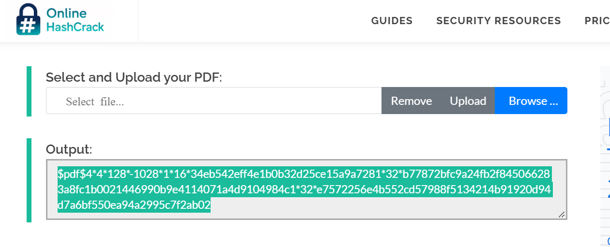
- 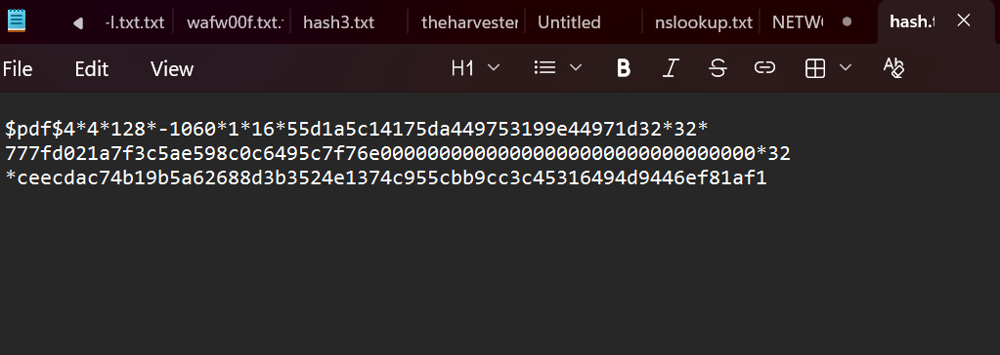
- 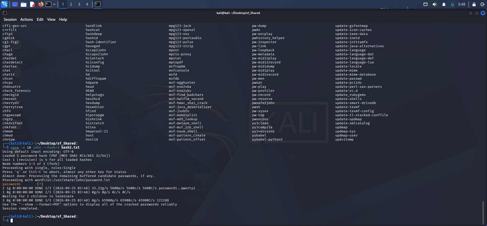
- 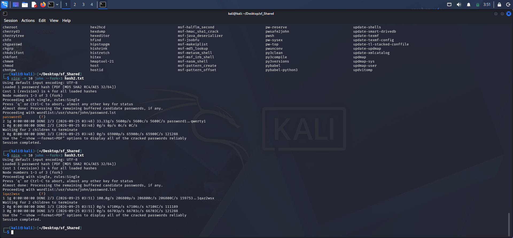
- 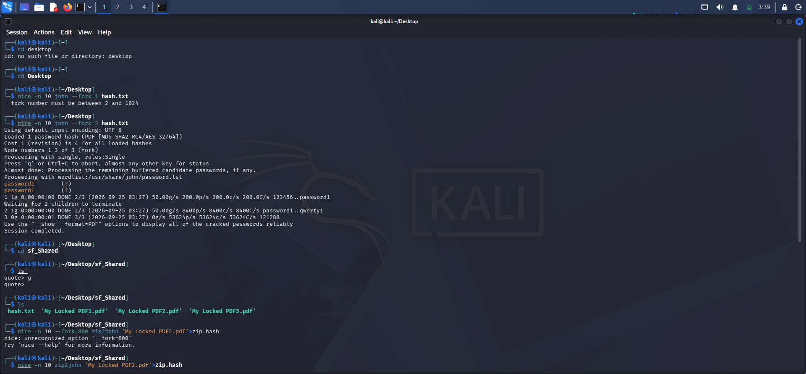
- 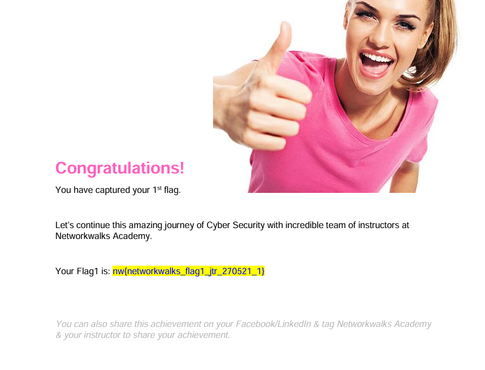
- 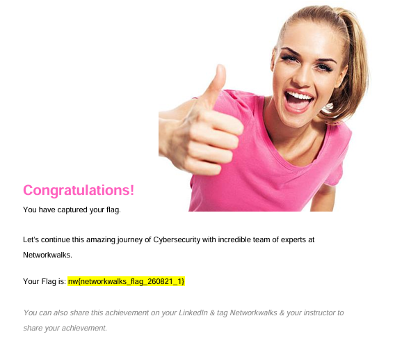
- 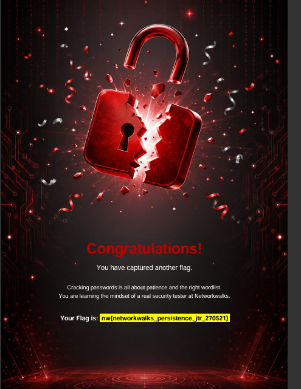
- 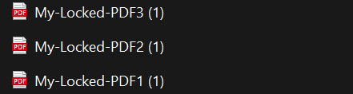
- 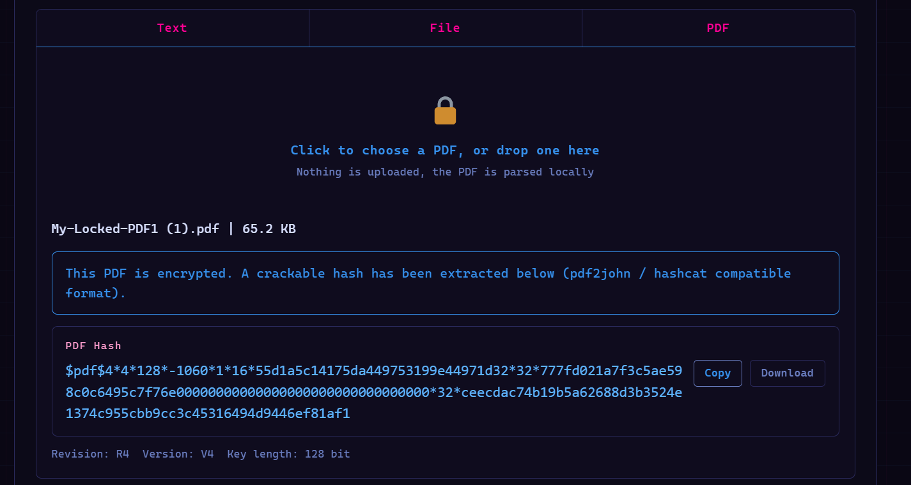
- 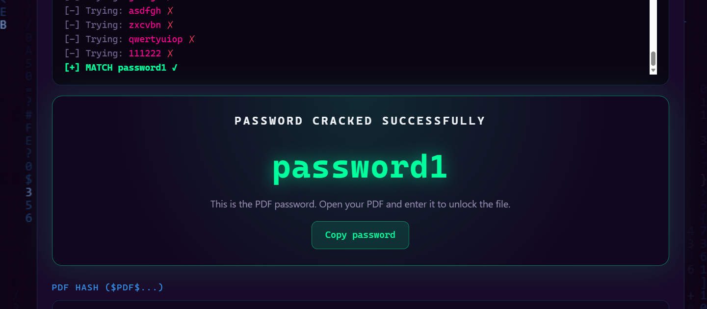
- 
- 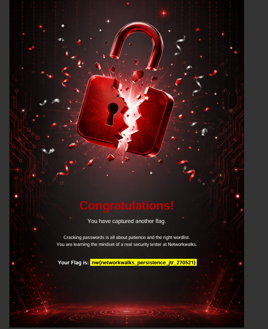
- 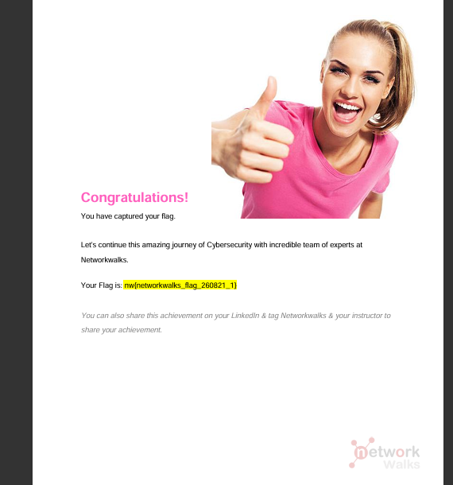
